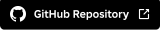
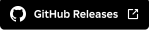

<a name="top"></a>

[](https://github.com/morgann1/studio-discover/releases/latest/download/Discover.rbxm)
[](https://github.com/morgann1/studio-discover)
[](https://github.com/morgann1/studio-discover/releases/latest)
[](./CHANGELOG.md)

## Table of Contents
- [Table of Contents](#table-of-contents)
- [🚀 About](#-about)
- [✨ What's New](#-whats-new)
  - [Version 3.5 (Latest)](#version-35-latest)
- [📝 How to Build](#-how-to-build)
  - [Prerequisites](#prerequisites)
  - [Build](#build)
- [🤝 Feedback and Contributions](#-feedback-and-contributions)
- [📃 License](#-license)

## 🚀 About

[Wally](https://wally.run/) is the most popular package manager for Roblox, but it's a CLI tool that lives outside of Studio. If you're a game creator who works purely in Roblox Studio, that means setting up Rokit, Rojo, and a whole external toolchain just to pull in a package. Not everyone wants to make that switch.

[studio-wally](https://github.com/fewkz/studio-wally) exists, but it hasn't been updated in over a year, [doesn't support the server realm](https://github.com/fewkz/studio-wally/issues/4), and depends on the [experimental Rojo headless API](https://github.com/rojo-rbx/rojo/pull/639).

Studio Discover is a pure-Luau alternative. It talks directly to the Wally registry over HTTP, handles both `shared` and `server` realms, re-exports package types through link modules, and writes everything into the DataModel. No external tools required. It does what `wally install` and `wally-package-types` do, entirely from inside Roblox Studio.

## ✨ What's New

### Version 3.5 (Latest)

🚨 **Breaking Changes**
- **"Backend URL" setting removed**: A Cloudflare Worker proxy was briefly added and then rolled back before this release. Any Backend URL you set is now ignored.

✏️ **Improvements**
- **Plugin renamed to "Studio Discover"**: Both the plugin title and the repo moved off the single-word "Discover" name to avoid naming collisions.
- **Direct Wally API calls**: The plugin now talks to `api.wally.run` directly with an `X-Real-User-Agent` header. UpliftGames confirmed direct Studio requests are fine, so the proxy is gone.
- **Wording refresh**: The plugin UI and README were rewritten to speak to game creators rather than pure developers.

🔒 **Security**
- **Anonymous-session guard**: The plugin won't load without a signed-in Studio user, so it can't make network calls on behalf of an unidentified session.

> See 📋 [`CHANGELOG.md`](./CHANGELOG.md) for full details.

## 📝 How to Build

### Prerequisites

You'll need [Rokit](https://github.com/rojo-rbx/rokit) installed.

### Build

To build the plugin, follow these steps:

```shell
# Open a terminal (Command Prompt or PowerShell for Windows, Terminal for macOS or Linux)

# Clone the repository
git clone https://github.com/morgann1/studio-discover.git

# Navigate to the project directory
cd studio-discover

# Install the toolchain
rokit install

# Install wally packages, patch in the `Foundation` package.
lune run install

# Build the plugin
lune run build
```

Then drag the generated `Discover.rbxm` into Roblox Studio, right-click the **Discover** folder in the Explorer, and pick **Save / Export > Save as Local Plugin**. A **Discover** button will appear in your toolbar.

> `lune run install` fetches the Wally packages, pulls Foundation from the pinned Roblox version, and applies anything under `plugin/patches/`.

> If you plan to fork this or contribute, also run `lune run setup`. Without it, luau-lsp won't resolve things out of the box.

## 🤝 Feedback and Contributions

TBD

## 📃 License

Studio Discover's own source is intended to be freely redistributable. Read it, fork it, modify it, ship it. There's no `LICENSE` file in the repo yet, but the intent is permissive (MIT or similar).

The one thing to watch out for is [Foundation](https://github.com/Roblox/foundation), Roblox's UI library. The built `Discover.rbxm` bundles it at build time, and Foundation is not open source, so redistributing the *built artifact* is subject to Roblox's terms for Foundation, not this repo's license. A proper `LICENSE` will be added once Foundation is either swapped out or its redistribution terms are confirmed.

For now: do whatever you want with the source in this repo, but check Foundation's terms before redistributing the build.

[Back to top](#top)