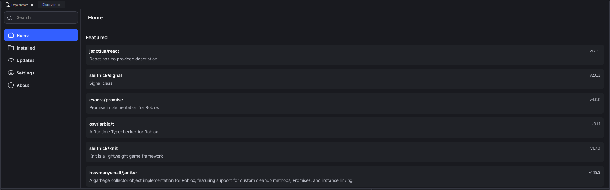
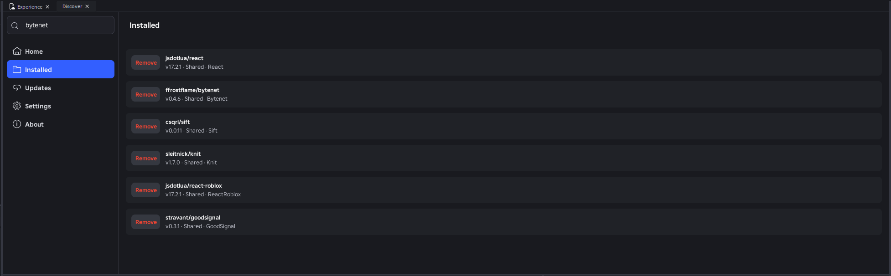
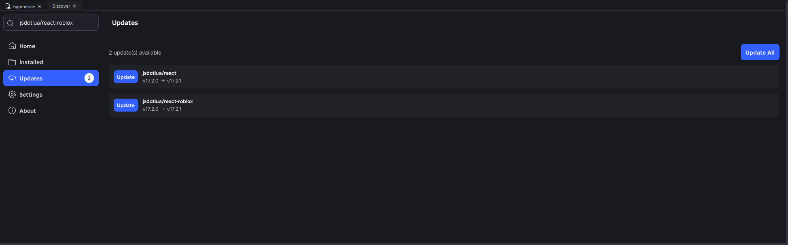
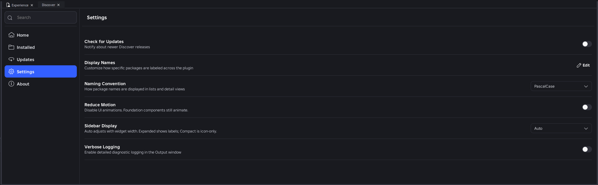
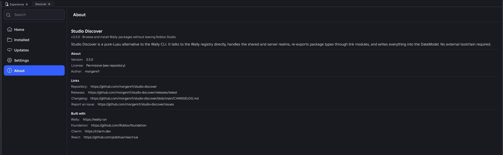
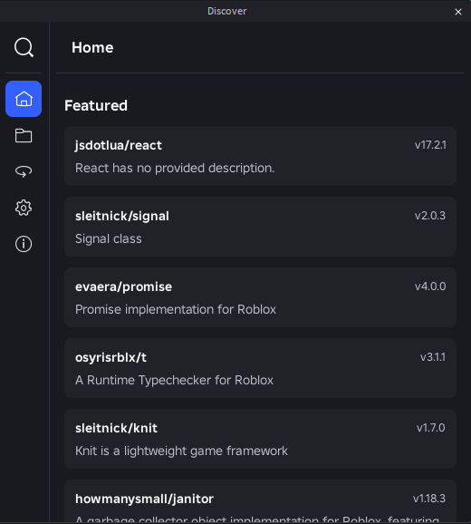
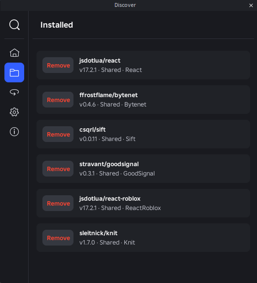
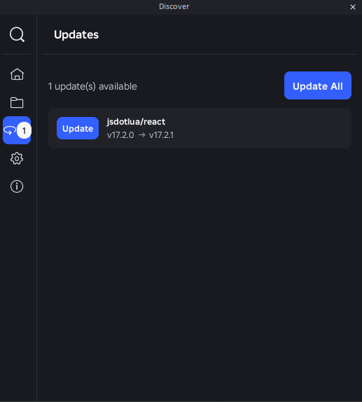
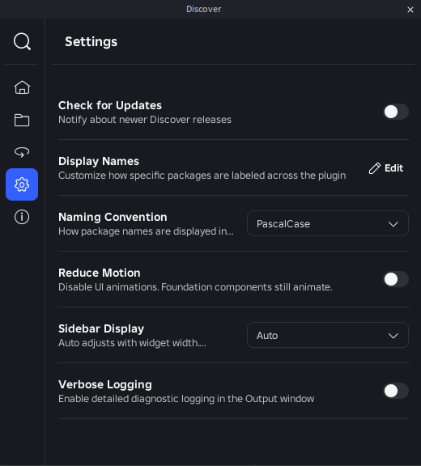
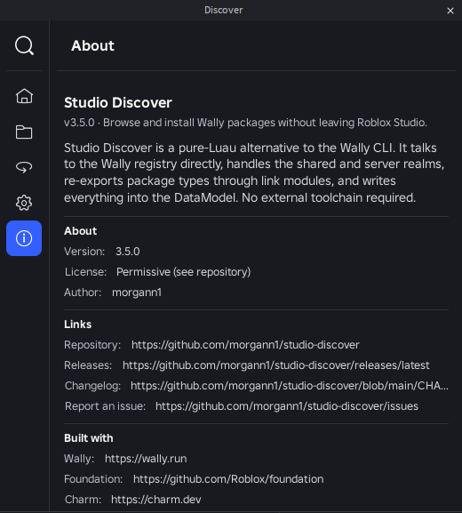

<a name="top"></a>


<div align="center">

[](https://github.com/morgann1/studio-discover/releases/latest/download/StudioDiscover.rbxm)
[](./CHANGELOG.md)
[](https://github.com/morgann1/studio-discover/releases/latest)
[](https://github.com/morgann1/studio-discover)
[](https://www.roblox.com/users/48044582/profile)
[](#-feedback-and-contributions)

[](https://github.com/morgann1/studio-discover/actions/workflows/ci.yml)
[](https://github.com/morgann1/studio-discover/actions/workflows/release.yml)

</div>

## Table of Contents
- [Table of Contents](#table-of-contents)
- [🚀 About](#-about)
- [📸 Screenshots](#-screenshots)
- [✨ What's New](#-whats-new)
  - [Version 3.6 (Latest)](#version-36-latest)
- [📝 How to Build](#-how-to-build)
  - [Prerequisites](#prerequisites)
  - [Build](#build)
- [🤝 Feedback and Contributions](#-feedback-and-contributions)
- [📃 License](#-license)

## 🚀 About

If you want to use a Luau package in Roblox Studio, the usual path is a bit of a trek. You install [Wally](https://wally.run/) or [pesde](https://pesde.dev/), set up Rokit, set up Rojo, wire it into your project, and only then can you actually `require` the thing. Great if you're already deep in that workflow. A lot of hassle if you just want to use a package.

Studio Discover skips the setup. Browse Wally and pesde packages from inside Studio, hit install, and the package shows up in your place — dependencies, types, and all.

## 📸 Screenshots

<details>
<summary>Click to expand</summary>

**Expanded sidebar**

<p align="center">
  
  
  <br />
  
  
  <br />
  
</p>

**Collapsed sidebar**

<p align="center">
  
  
  <br />
  
  
  <br />
  
</p>

</details>

## ✨ What's New

### Version 3.6 (Latest)

✨ **New**
- **Installed page**: lists every top-level package with a Remove action that also drops orphaned dependencies.
- **Updates page**: lists packages with a newer release and offers per-row and "Update All" actions.
- **Home page**: opens on a curated Featured list instead of a blank placeholder.
- **Display Names setting**: override the auto-formatted alias per package name (scope-agnostic).
- **About page**: version, license, links, credits, and an optional release-check row.
- **Progress-bar buttons**: Install, Remove, and Update morph into an indeterminate progress bar while the operation runs.

✏️ **Improvements**
- **Concurrent-op mutex**: install, uninstall, and update can no longer race on the `_Index` or the lockfile.
- **Prior roots preserved**: a new install merges with your existing packages instead of wiping them. Re-installing the same `(realm, scope, name)` swaps version or alias in place, and formatted-alias collisions disambiguate with a numeric suffix.
- **Install state persists**: the Install button reads the packages folder, not just the transient installer atom, so a package you already installed still shows as Installed after reopening Studio.
- **Studio user id in requests**: `X-Real-User-Agent` now identifies the signed-in Studio user, and the plugin skips init entirely when no user is signed in.

🛠 **Fixes**
- Root-package apply failures cancel the ChangeHistory waypoint so a botched install doesn't land on the undo stack.
- Wally `/package-contents` requests now send the `Wally-Version` header required by the registry.
- Uninstall and update surface errors inline and reset the row action instead of sticking in a progress state.
- Long search-result titles and descriptions wrap instead of overflowing the dock widget.

> See 📋 [`CHANGELOG.md`](./CHANGELOG.md) for full details.

## 📝 How to Build

### Prerequisites

You'll need [Rokit](https://github.com/rojo-rbx/rokit) installed.

### Build

To build the plugin, follow these steps:

```shell
# Open a terminal (Command Prompt or PowerShell for Windows, Terminal for macOS or Linux)

# Clone the repository
git clone https://github.com/morgann1/studio-discover.git

# Navigate to the project directory
cd studio-discover

# Install the toolchain
rokit install

# Install wally packages, patch in the `Foundation` package.
lute run install

# Build the plugin
lute run build
```

Then drag the generated `StudioDiscover.rbxm` into Roblox Studio, right-click the **Discover** folder in the Explorer, and pick **Save / Export > Save as Local Plugin**. A **Discover** button will appear in your toolbar.

> `lute run install` fetches the Wally packages, pulls Foundation from the pinned Roblox version, and applies anything under `plugin/patches/`.

> If you plan to fork this or contribute, also run `lute run setup`. Without it, luau-lsp won't resolve things out of the box.

> To test changes alongside the creator store version without collisions, run `lute run build --dev`. This produces `StudioDiscover-Dev.rbxm` with its own toolbar slot, widget, and plugin settings namespace.

### Releasing to the Creator Store

Pushing a `v*` tag runs `.github/workflows/release.yml`, which builds the plugin, creates a GitHub release, and updates the Creator Store listing via [`rbxasset`](https://github.com/Roblox/rbxasset).

One-time setup before the first release:

1. Fill in `rbxasset.toml` with the creator and experience IDs (required by rbxasset's schema even when only updating an existing asset).
2. Fill in `rbxasset.lock` with the existing plugin's asset ID — create the listing once through Studio, then copy the ID from its Creator Store URL. Leave it unset only if you want rbxasset to create the listing on the first run.
3. Add repo secret `ROBLOX_API_KEY` — an Open Cloud API key with the `Assets:Write` scope for the creator account that owns the listing.

## 🤝 Feedback and Contributions

Issues and pull requests are welcome.

- **Bugs and feature requests**: open an issue at [GitHub Issues](https://github.com/morgann1/studio-discover/issues).
- **Pull requests**: before opening one, please file an issue describing the change so we can agree on direction. Run `lute run ci` locally before pushing. It mirrors what CI checks.
- **Scope**: contributions that fit the project's goals (see [About](#-about)) are the easiest to land. Studio Discover is a solo project, so response times vary.

## 📃 License

Studio Discover's own source is intended to be freely redistributable. Read it, fork it, modify it, ship it. There's no `LICENSE` file in the repo yet, but the intent is permissive (MIT or similar).

The one thing to watch out for is [Foundation](https://github.com/Roblox/foundation), Roblox's UI library. The built `StudioDiscover.rbxm` bundles it at build time, and Foundation is not open source, so redistributing the *built artifact* is subject to Roblox's terms for Foundation, not this repo's license. A proper `LICENSE` will be added once Foundation is either swapped out or its redistribution terms are confirmed.

For now: do whatever you want with the source in this repo, but check Foundation's terms before redistributing the build.

[Back to top](#top)