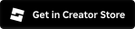
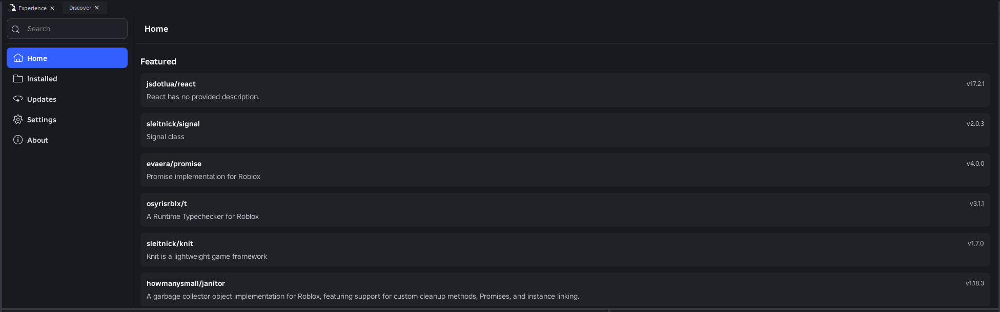

<h1 align="center">
  
   
  Studio Discover
</h1>

  
  

Studio Discover lets you pull [Wally](https://wally.run) and [pesde](https://pesde.dev/) packages into Studio without setting up a whole repository. Dependencies and types come with them.

## License

Studio Discover is available under the MIT license. See [LICENSE](LICENSE) for details.