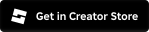
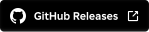
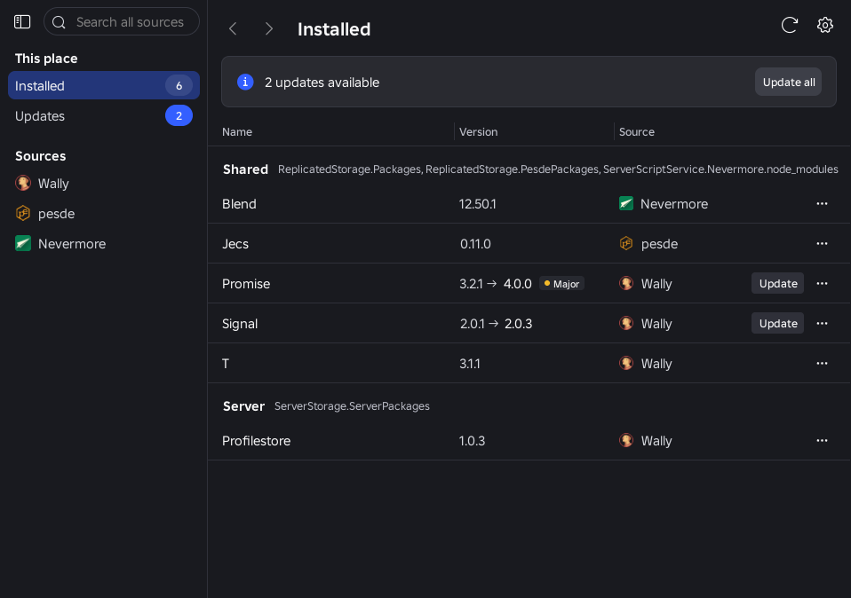
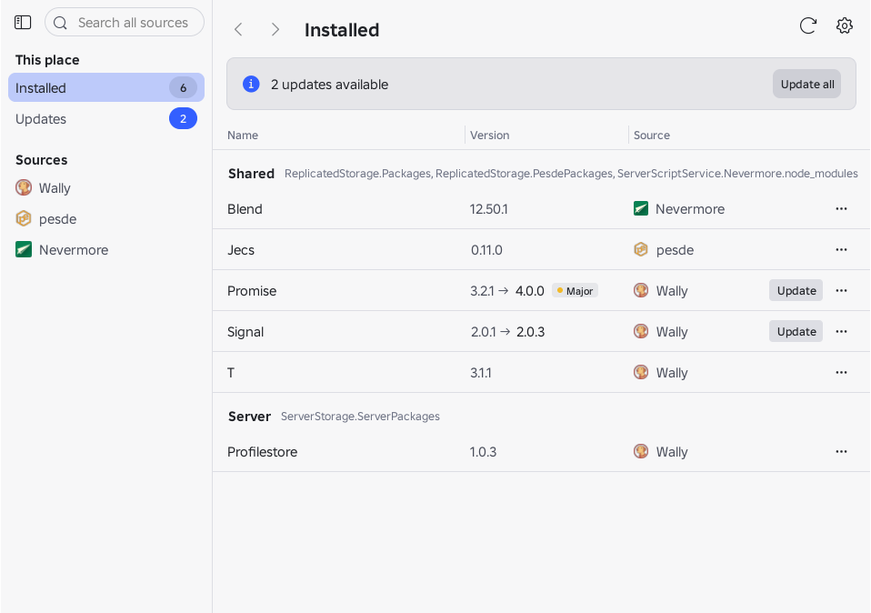

<h1 align="center">
  
   
  Studio Discover
</h1>

  
  
  

Studio Discover lets you pull [Wally](https://wally.run), [pesde](https://pesde.dev/), and [Nevermore](https://quenty.github.io/NevermoreEngine/) packages into Studio without setting up a whole repository. Dependencies and types come with them.

Nevermore packages install the way the Nevermore docs lay a game out. The first one adds `ServerScriptService.Nevermore`, with your own code going in `game` and the packages in `node_modules`, plus `ServerMain` and `ClientMain` scripts that start the loader. Those scripts and folders are yours afterward, and removing packages never touches them.

<table>
  <tr>
    <th>Dark</th>
    <th>Light</th>
  </tr>
  <tr>
    <td width="50%"></td>
    <td width="50%"></td>
  </tr>
</table>

## License

Studio Discover's original source code is available under the [MIT license](LICENSE).

Roblox's Foundation UI components retain their upstream licensing terms. A copy of Roblox's Limited Use License is included in [LICENSE-ROBLOX](LICENSE-ROBLOX). Its applicability to the bundled Foundation components has not been confirmed.

Other dependencies retain their respective licenses.
